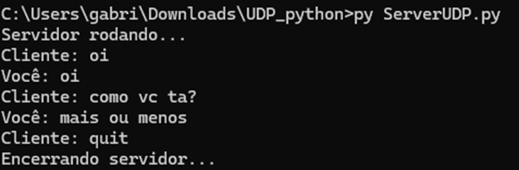
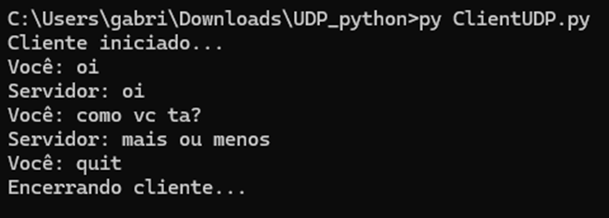

# Controle Remoto de Objeto via Socket TCP + Pygame

**Atividade: Análise de Programação de Socket UDP e TCP**  
**Disciplina:** Redes de Computadores  
**Professor:** Dr. Bruno da Silva Rodrigues  
**Alunos:** João Francisco RA:10443666
            Gabriel Messora RA:
            Luis Felipe RA:

# Questão 1

a) Ao executar o cliente antes do servidor, ocorre erro de conexão (connection refused), pois o protocolo TCP é orientado à conexão e exige que o servidor esteja ativo e escutando na porta para que a conexão seja estabelecida.

b) No caso do UDP, o cliente consegue enviar a mensagem mesmo sem o servidor estar ativo, pois o protocolo UDP não é orientado à conexão. No entanto, a mensagem pode não ser recebida, já que não há garantia de entrega.

c) Se o cliente tentar se conectar a uma porta diferente da porta em que o servidor está escutando, a conexão não será estabelecida, pois não haverá nenhum serviço disponível naquela porta no destino.

# Questão 2
## Prints de execução do código



# Questão 3
## Descrição do Projeto
Aplicação de **controle remoto de objeto** usando socket **TCP** e biblioteca **Pygame**.  

O servidor abre uma janela gráfica (Pygame) com um quadrado azul.  
O cliente (console) envia comandos (WASD) para mover o quadrado.  
Foi utilizada **thread** para separar a recepção de comandos do loop gráfico do Pygame.

**Por que TCP?**  
Garante entrega confiável e na ordem correta dos comandos (diferente do UDP).

- Usa Pygame + socket + thread

## Como Executar

### Requisitos
- Python 3.8+
- Biblioteca Pygame: `pip install pygame`

### Passo a passo
1. Abra **dois terminais/IDLE** (ou dois computadores).
2. No primeiro terminal execute o servidor:
   ```bash
   python ServerRemoteControl.py

### Link video no Youtube Questão 1 e 2
Link: https://youtu.be/P1JGSdz8dNg?si=xA_KzCkI5FSBQxne

### Link video no Youtube Questão 3
Link: https://youtu.be/zECnosptRZc


2)
 
 


